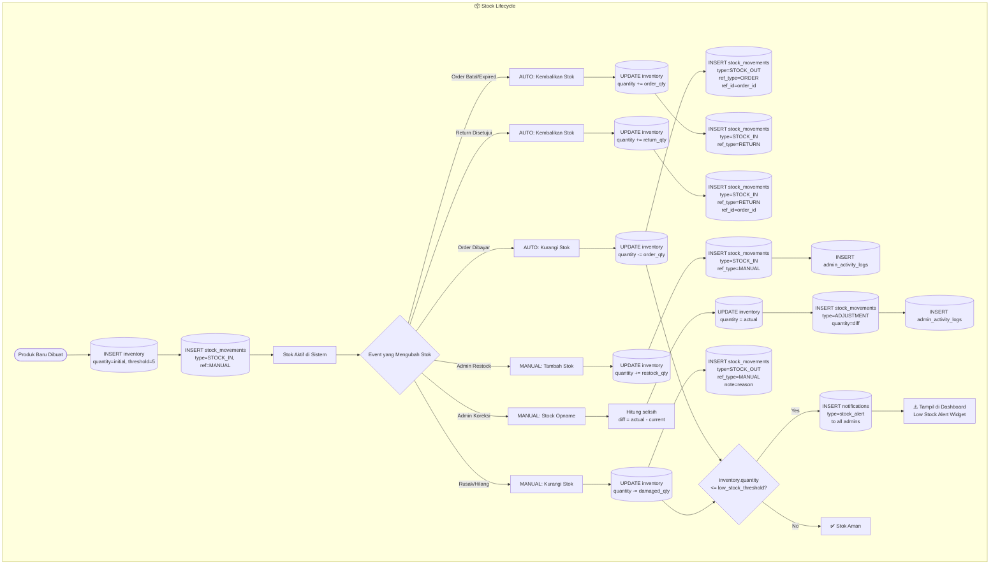

# ERD Lengkap — OrchidMart

> **Versi**: 2.0 (Complete)  
> **Database**: PostgreSQL  
> **Total Tabel**: 19 tabel  
> **Cakupan**: Seluruh flow Customer & Admin dari login sampai selesai

---

## 1. ER Diagram — Seluruh Entitas

```mermaid
erDiagram
    %% ============================
    %% AUTH & USER MANAGEMENT
    %% ============================

    USERS {
        UUID id PK
        VARCHAR email UK
        VARCHAR password_hash
        VARCHAR full_name
        VARCHAR phone
        VARCHAR role "customer | admin"
        VARCHAR customer_type "B2B | B2C"
        BOOLEAN is_active
        VARCHAR avatar_url
        TIMESTAMP last_login_at
        TIMESTAMP created_at
        TIMESTAMP updated_at
    }

    REFRESH_TOKENS {
        UUID id PK
        UUID user_id FK
        VARCHAR token UK
        VARCHAR ip_address
        VARCHAR user_agent
        BOOLEAN is_revoked
        TIMESTAMP expires_at
        TIMESTAMP created_at
    }

    PASSWORD_RESETS {
        UUID id PK
        UUID user_id FK
        VARCHAR token UK
        BOOLEAN is_used
        TIMESTAMP expires_at
        TIMESTAMP created_at
    }

    ADDRESSES {
        UUID id PK
        UUID user_id FK
        VARCHAR label "Rumah | Kantor | Nursery"
        VARCHAR recipient_name
        VARCHAR phone
        VARCHAR province
        VARCHAR province_id "RajaOngkir ID"
        VARCHAR city
        VARCHAR city_id "RajaOngkir ID"
        VARCHAR district
        VARCHAR postal_code
        TEXT full_address
        BOOLEAN is_default
        TIMESTAMP created_at
        TIMESTAMP updated_at
    }

    %% ============================
    %% PRODUCT CATALOG
    %% ============================

    CATEGORIES {
        UUID id PK
        VARCHAR name
        VARCHAR slug UK
        TEXT description
        VARCHAR image_url
        UUID parent_id FK "Self-ref subcategory"
        INT sort_order
        BOOLEAN is_active
        TIMESTAMP created_at
        TIMESTAMP updated_at
    }

    PRODUCTS {
        UUID id PK
        UUID category_id FK
        VARCHAR name
        VARCHAR slug UK
        VARCHAR variety_name "Nama Latin varietas"
        TEXT description
        DECIMAL price
        INT weight_gram "Berat untuk ongkir"
        VARCHAR size "seedling | remaja | dewasa | berbunga"
        VARCHAR condition "berbunga | knop | vegetatif"
        VARCHAR unit_type "PER_POHON | PER_BATCH | PER_VARIETAS"
        INT batch_quantity "Qty per batch"
        TEXT care_tips
        TEXT_ARRAY tags "rare | bestseller | new | promo"
        VARCHAR status "active | inactive | draft"
        TIMESTAMP created_at
        TIMESTAMP updated_at
    }

    PRODUCT_IMAGES {
        UUID id PK
        UUID product_id FK
        VARCHAR image_url
        VARCHAR alt_text
        INT sort_order
        BOOLEAN is_primary
        TIMESTAMP created_at
    }

    %% ============================
    %% INVENTORY & STOCK
    %% ============================

    INVENTORY {
        UUID id PK
        UUID product_id FK_UK "1-to-1"
        INT quantity
        INT low_stock_threshold "Default 5"
        TIMESTAMP updated_at
    }

    STOCK_MOVEMENTS {
        UUID id PK
        UUID product_id FK
        VARCHAR movement_type "STOCK_IN | STOCK_OUT | ADJUSTMENT"
        INT quantity "Positive or negative"
        VARCHAR reference_type "ORDER | MANUAL | RETURN | OPNAME"
        VARCHAR reference_id "order_id or note"
        TEXT note
        UUID performed_by FK "Admin user_id"
        TIMESTAMP created_at
    }

    %% ============================
    %% SHOPPING
    %% ============================

    WISHLISTS {
        UUID id PK
        UUID user_id FK
        UUID product_id FK
        TIMESTAMP created_at
    }

    CARTS {
        UUID id PK
        UUID user_id FK_UK "1-to-1"
        TIMESTAMP created_at
        TIMESTAMP updated_at
    }

    CART_ITEMS {
        UUID id PK
        UUID cart_id FK
        UUID product_id FK
        INT quantity
        TEXT note "Catatan khusus"
        TIMESTAMP created_at
        TIMESTAMP updated_at
    }

    %% ============================
    %% ORDERS & PAYMENTS
    %% ============================

    ORDERS {
        UUID id PK
        VARCHAR order_number UK "ORD-YYYYMMDD-XXXX"
        UUID user_id FK
        VARCHAR shipping_name "Snapshot"
        VARCHAR shipping_phone "Snapshot"
        TEXT shipping_address "Snapshot"
        VARCHAR shipping_city "Snapshot"
        VARCHAR shipping_province "Snapshot"
        VARCHAR shipping_postal_code "Snapshot"
        VARCHAR courier_code "jne | jnt | sicepat | anteraja | pos"
        VARCHAR courier_service "REG | YES | OKE | BEST"
        DECIMAL shipping_cost
        VARCHAR tracking_number
        DECIMAL subtotal
        DECIMAL discount
        VARCHAR coupon_code "Applied coupon"
        DECIMAL total
        VARCHAR status "PENDING_PAYMENT | PAID | etc"
        TEXT note "Buyer note"
        TEXT admin_note "Internal note"
        TIMESTAMP paid_at
        TIMESTAMP shipped_at
        TIMESTAMP delivered_at
        TIMESTAMP completed_at
        TIMESTAMP cancelled_at
        TIMESTAMP created_at
        TIMESTAMP updated_at
    }

    ORDER_ITEMS {
        UUID id PK
        UUID order_id FK
        UUID product_id FK
        VARCHAR product_name "Snapshot"
        VARCHAR product_image_url "Snapshot"
        DECIMAL product_price "Snapshot"
        VARCHAR unit_type "Snapshot"
        INT quantity
        DECIMAL subtotal
        TIMESTAMP created_at
    }

    ORDER_STATUS_HISTORY {
        UUID id PK
        UUID order_id FK
        VARCHAR from_status
        VARCHAR to_status
        TEXT note "Reason for change"
        UUID changed_by FK "user_id admin or system"
        TIMESTAMP created_at
    }

    PAYMENTS {
        UUID id PK
        UUID order_id FK
        VARCHAR method "bank_transfer | ewallet | credit_card | cod"
        VARCHAR provider "midtrans | manual"
        VARCHAR external_id "Payment gateway ID"
        DECIMAL amount
        VARCHAR status "PENDING | PAID | EXPIRED | REFUNDED"
        VARCHAR payment_url "Redirect URL"
        VARCHAR proof_image_url "Bukti transfer"
        TEXT failure_reason
        TIMESTAMP paid_at
        TIMESTAMP expired_at
        TIMESTAMP created_at
        TIMESTAMP updated_at
    }

    %% ============================
    %% REVIEWS
    %% ============================

    REVIEWS {
        UUID id PK
        UUID product_id FK
        UUID user_id FK
        UUID order_id FK
        INT rating "1 to 5"
        TEXT comment
        TIMESTAMP created_at
    }

    %% ============================
    %% COUPONS
    %% ============================

    COUPONS {
        UUID id PK
        VARCHAR code UK
        TEXT description
        VARCHAR discount_type "percentage | fixed"
        DECIMAL discount_value
        DECIMAL min_purchase
        DECIMAL max_discount
        INT usage_limit
        INT used_count
        TIMESTAMP valid_from
        TIMESTAMP valid_until
        BOOLEAN is_active
        TIMESTAMP created_at
    }

    %% ============================
    %% NOTIFICATIONS
    %% ============================

    NOTIFICATIONS {
        UUID id PK
        UUID user_id FK
        VARCHAR type "order_status | payment | promo | stock_alert"
        VARCHAR title
        TEXT message
        VARCHAR reference_type "order | product | payment"
        UUID reference_id
        BOOLEAN is_read
        TIMESTAMP read_at
        TIMESTAMP created_at
    }

    %% ============================
    %% ADMIN AUDIT LOG
    %% ============================

    ADMIN_ACTIVITY_LOGS {
        UUID id PK
        UUID admin_id FK
        VARCHAR action "CREATE | UPDATE | DELETE | LOGIN | EXPORT"
        VARCHAR entity_type "product | order | inventory | customer"
        UUID entity_id
        JSONB old_values
        JSONB new_values
        VARCHAR ip_address
        TIMESTAMP created_at
    }

    %% ============================
    %% ALL RELATIONSHIPS
    %% ============================

    USERS ||--o{ REFRESH_TOKENS : "authenticates via"
    USERS ||--o{ PASSWORD_RESETS : "resets password"
    USERS ||--o{ ADDRESSES : "has addresses"
    USERS ||--o| CARTS : "has cart"
    USERS ||--o{ WISHLISTS : "saves favorites"
    USERS ||--o{ ORDERS : "places orders"
    USERS ||--o{ REVIEWS : "writes reviews"
    USERS ||--o{ NOTIFICATIONS : "receives"
    USERS ||--o{ STOCK_MOVEMENTS : "performs (admin)"
    USERS ||--o{ ORDER_STATUS_HISTORY : "changes (admin)"
    USERS ||--o{ ADMIN_ACTIVITY_LOGS : "logged actions"

    CATEGORIES ||--o{ PRODUCTS : "contains"
    CATEGORIES ||--o{ CATEGORIES : "has subcategories"

    PRODUCTS ||--o{ PRODUCT_IMAGES : "has images"
    PRODUCTS ||--|| INVENTORY : "has stock"
    PRODUCTS ||--o{ STOCK_MOVEMENTS : "tracked by"
    PRODUCTS ||--o{ WISHLISTS : "saved in"
    PRODUCTS ||--o{ CART_ITEMS : "added to"
    PRODUCTS ||--o{ ORDER_ITEMS : "ordered as"
    PRODUCTS ||--o{ REVIEWS : "reviewed in"

    CARTS ||--o{ CART_ITEMS : "contains"

    ORDERS ||--o{ ORDER_ITEMS : "contains"
    ORDERS ||--o{ ORDER_STATUS_HISTORY : "status tracked"
    ORDERS ||--o{ PAYMENTS : "paid via"
    ORDERS ||--o{ REVIEWS : "reviewed after"
```

---

## 2. Flow Diagram — Customer Journey (Lengkap)

```mermaid
flowchart TD
    START([🌺 Customer Mulai]) --> AUTH_CHECK{Sudah Login?}

    %% === AUTH FLOW ===
    AUTH_CHECK -->|Belum| REG_OR_LOGIN{Register atau Login?}
    REG_OR_LOGIN -->|Register| REGISTER[📝 Isi Form Register<br/>email, password, nama, phone]
    REGISTER --> SAVE_USER[(💾 INSERT users)]
    SAVE_USER --> CREATE_CART[(💾 INSERT carts)]
    CREATE_CART --> LOGIN_PAGE[🔐 Halaman Login]

    REG_OR_LOGIN -->|Login| LOGIN_PAGE
    LOGIN_PAGE --> VALIDATE{Validasi<br/>Email & Password}
    VALIDATE -->|Gagal| LOGIN_ERROR[❌ Error: kredensial salah<br/>Rate limit 5x/15min]
    LOGIN_ERROR --> LOGIN_PAGE
    VALIDATE -->|Berhasil| GEN_JWT[🔑 Generate JWT<br/>Access + Refresh Token]
    GEN_JWT --> SAVE_TOKEN[(💾 INSERT refresh_tokens)]
    SAVE_TOKEN --> LOGGED_IN[✅ User Logged In]

    AUTH_CHECK -->|Sudah| LOGGED_IN

    %% === FORGOT PASSWORD ===
    LOGIN_PAGE --> FORGOT[Lupa Password?]
    FORGOT --> SEND_RESET[📧 Kirim Reset Email]
    SEND_RESET --> SAVE_RESET[(💾 INSERT password_resets)]
    SAVE_RESET --> RESET_FORM[🔒 Form Reset Password]
    RESET_FORM --> UPDATE_PASS[(💾 UPDATE users.password_hash)]
    UPDATE_PASS --> LOGIN_PAGE

    %% === BROWSE & SHOP ===
    LOGGED_IN --> BROWSE[🛒 Browse Katalog Produk]
    BROWSE --> SEARCH_FILTER[🔍 Search, Filter, Sort]
    SEARCH_FILTER --> PRODUCT_LIST[(📖 SELECT products<br/>+ inventory + images)]
    PRODUCT_LIST --> DETAIL[📋 Lihat Detail Produk]

    DETAIL --> WISHLIST_ADD[💖 Simpan ke Wishlist]
    WISHLIST_ADD --> SAVE_WISH[(💾 INSERT wishlists)]

    DETAIL --> ADD_CART[🛒 Tambah ke Keranjang]
    ADD_CART --> CHECK_STOCK{Stok Tersedia?}
    CHECK_STOCK -->|Tidak| OUT_STOCK[❌ Stok Habis]
    CHECK_STOCK -->|Ya| SAVE_CART[(💾 INSERT cart_items)]

    %% === CART & CHECKOUT ===
    SAVE_CART --> VIEW_CART[🛒 Lihat Keranjang]
    VIEW_CART --> EDIT_QTY[📝 Edit Qty / Hapus Item]
    EDIT_QTY --> UPDATE_CART[(💾 UPDATE/DELETE cart_items)]
    UPDATE_CART --> VIEW_CART

    VIEW_CART --> CHECKOUT[💳 Checkout]
    CHECKOUT --> SELECT_ADDRESS[📍 Pilih Alamat Pengiriman]
    SELECT_ADDRESS --> ADD_ADDRESS[➕ Tambah Alamat Baru?]
    ADD_ADDRESS --> SAVE_ADDRESS[(💾 INSERT addresses)]
    SAVE_ADDRESS --> SELECT_ADDRESS
    SELECT_ADDRESS --> SELECT_COURIER[🚚 Pilih Ekspedisi<br/>JNE / J&T / SiCepat / dll]
    SELECT_COURIER --> CALC_ONGKIR[📊 Hitung Ongkir<br/>via RajaOngkir API]
    CALC_ONGKIR --> APPLY_COUPON[🎫 Masukkan Kode Kupon?]
    APPLY_COUPON --> VALIDATE_COUPON[(📖 SELECT coupons)]
    VALIDATE_COUPON --> ORDER_SUMMARY[📋 Ringkasan Pesanan<br/>Subtotal + Ongkir - Diskon = Total]

    %% === ORDER CREATION ===
    ORDER_SUMMARY --> CONFIRM[✅ Konfirmasi Order]
    CONFIRM --> CREATE_ORDER[(💾 INSERT orders)]
    CREATE_ORDER --> CREATE_ITEMS[(💾 INSERT order_items<br/>Snapshot produk)]
    CREATE_ITEMS --> STATUS_HIST_1[(💾 INSERT order_status_history<br/>→ PENDING_PAYMENT)]
    STATUS_HIST_1 --> CLEAR_CART[(💾 DELETE cart_items)]
    CLEAR_CART --> NOTIF_ORDER[(💾 INSERT notifications<br/>Order berhasil dibuat)]

    %% === PAYMENT ===
    NOTIF_ORDER --> SELECT_PAY{Pilih Metode Bayar}
    SELECT_PAY -->|Transfer Bank| VA[🏦 Virtual Account<br/>BCA/BNI/BRI/Mandiri]
    SELECT_PAY -->|E-Wallet| EWALLET[📱 GoPay/OVO<br/>DANA/ShopeePay]
    SELECT_PAY -->|Kartu Kredit| CC[💳 Visa/Mastercard]
    SELECT_PAY -->|COD| COD[📦 Bayar di Tempat]

    VA --> MIDTRANS_CREATE[(💾 INSERT payments<br/>+ Midtrans API call)]
    EWALLET --> MIDTRANS_CREATE
    CC --> MIDTRANS_CREATE
    COD --> COD_PAYMENT[(💾 INSERT payments<br/>method=cod, status=PENDING)]

    MIDTRANS_CREATE --> PAY_PAGE[💰 Halaman Pembayaran<br/>Batas waktu: 24 jam]
    PAY_PAGE --> MANUAL_PROOF{Transfer Manual?}
    MANUAL_PROOF -->|Ya| UPLOAD[📤 Upload Bukti Transfer]
    UPLOAD --> SAVE_PROOF[(💾 UPDATE payments.proof_image_url)]
    MANUAL_PROOF -->|Tidak| WAIT_WEBHOOK[⏳ Menunggu Webhook Midtrans]

    WAIT_WEBHOOK --> WEBHOOK{Webhook Callback}
    SAVE_PROOF --> WEBHOOK
    WEBHOOK -->|Success| PAID[(💾 UPDATE payments.status=PAID<br/>UPDATE orders.status=PAID)]
    WEBHOOK -->|Failed/Expired| EXPIRED[(💾 UPDATE payments.status=EXPIRED)]
    EXPIRED --> RESTORE_STOCK[(💾 Restore stock jika sudah di-hold)]
    RESTORE_STOCK --> CANCELLED_ORDER[❌ Order Dibatalkan]

    PAID --> STATUS_HIST_2[(💾 INSERT order_status_history<br/>→ PAID)]
    STATUS_HIST_2 --> NOTIF_PAID[(💾 INSERT notifications<br/>Pembayaran berhasil)]
    NOTIF_PAID --> REDUCE_STOCK[(💾 UPDATE inventory.quantity<br/>INSERT stock_movements STOCK_OUT)]

    %% === POST-PAYMENT (CUSTOMER VIEW) ===
    REDUCE_STOCK --> WAIT_PROCESS[⏳ Menunggu Admin Proses]
    WAIT_PROCESS --> NOTIF_SHIPPED[(💾 INSERT notifications<br/>Pesanan dikirim + No Resi)]
    NOTIF_SHIPPED --> TRACK[📍 Tracking Pengiriman]
    TRACK --> DELIVERED_Q{Barang Sampai?}
    DELIVERED_Q -->|Ya, Bagus| CONFIRM_RECEIVE[✅ Konfirmasi Terima]
    DELIVERED_Q -->|Ada Masalah| REQUEST_RETURN[❗ Ajukan Retur/Komplain]

    CONFIRM_RECEIVE --> STATUS_DELIVERED[(💾 UPDATE orders.status=DELIVERED)]
    STATUS_DELIVERED --> AUTO_COMPLETE[⏱ Auto COMPLETED<br/>setelah 3 hari]
    AUTO_COMPLETE --> WRITE_REVIEW[⭐ Tulis Review & Rating]
    WRITE_REVIEW --> SAVE_REVIEW[(💾 INSERT reviews)]
    SAVE_REVIEW --> DONE([🎉 Selesai!])

    REQUEST_RETURN --> STATUS_RETURN[(💾 UPDATE orders.status=RETURN_REQUESTED)]
    STATUS_RETURN --> WAIT_ADMIN_RETURN[⏳ Menunggu Keputusan Admin]
    WAIT_ADMIN_RETURN -->|Disetujui| REFUNDED[(💾 UPDATE → REFUNDED<br/>Restore stock)]
    WAIT_ADMIN_RETURN -->|Ditolak| AUTO_COMPLETE

    COD_PAYMENT --> WAIT_PROCESS
```



---

## 3. Flow Diagram — Admin Journey (Lengkap)

```mermaid
flowchart TD
    START([🔐 Admin Mulai]) --> LOGIN[Login Admin<br/>email + password]
    LOGIN --> VALIDATE{Validasi Kredensial<br/>+ Cek role=admin}
    VALIDATE -->|Gagal| ERROR[❌ Akses Ditolak]
    VALIDATE -->|Berhasil| JWT[🔑 Generate JWT Admin]
    JWT --> LOG_LOGIN[(💾 INSERT admin_activity_logs<br/>action=LOGIN)]
    LOG_LOGIN --> DASHBOARD[📊 Dashboard Overview]

    %% === DASHBOARD ===
    DASHBOARD --> KPI[📈 KPI Cards<br/>Revenue, Orders, AOV, Customers]
    KPI --> SALES_CHART[📉 Grafik Penjualan]
    SALES_CHART --> LOW_STOCK_ALERT[⚠️ Alert Stok Rendah]
    LOW_STOCK_ALERT --> RECENT_ORDERS[📋 Pesanan Terbaru]
    RECENT_ORDERS --> MENU{Pilih Menu Admin}

    %% === PRODUK ===
    MENU -->|Produk| PROD_LIST[📦 List Produk]
    PROD_LIST --> PROD_ADD[➕ Tambah Produk Baru]
    PROD_ADD --> PROD_FORM[📝 Form Produk<br/>Nama, Varietas, Harga, Kategori<br/>Deskripsi, Ukuran, Kondisi<br/>Unit Type, Batch Qty, Care Tips]
    PROD_FORM --> UPLOAD_IMG[📸 Upload Gambar<br/>Max 8 gambar]
    UPLOAD_IMG --> SAVE_IMAGES[(💾 INSERT product_images<br/>Upload ke MinIO/S3)]
    SAVE_IMAGES --> SAVE_PROD[(💾 INSERT products)]
    SAVE_PROD --> INIT_STOCK[(💾 INSERT inventory<br/>Set initial quantity)]
    INIT_STOCK --> LOG_PROD[(💾 INSERT admin_activity_logs<br/>action=CREATE, entity=product)]
    LOG_PROD --> PROD_LIST

    PROD_LIST --> PROD_EDIT[✏️ Edit Produk]
    PROD_EDIT --> UPDATE_PROD[(💾 UPDATE products)]
    UPDATE_PROD --> LOG_EDIT[(💾 INSERT admin_activity_logs<br/>action=UPDATE + old/new values)]
    LOG_EDIT --> PROD_LIST

    PROD_LIST --> PROD_STATUS[🔄 Toggle Status<br/>active / inactive / draft]
    PROD_STATUS --> UPDATE_STATUS[(💾 UPDATE products.status)]
    UPDATE_STATUS --> PROD_LIST

    PROD_LIST --> CAT_MANAGE[📂 Kelola Kategori]
    CAT_MANAGE --> CAT_CRUD[(💾 INSERT/UPDATE/DELETE categories)]
    CAT_CRUD --> PROD_LIST

    %% === STOK ===
    MENU -->|Inventori| STOCK_LIST[📊 List Stok Semua Produk]
    STOCK_LIST --> STOCK_DETAIL[📋 Detail Stok Produk]
    STOCK_DETAIL --> STOCK_UPDATE{Tipe Update Stok}

    STOCK_UPDATE -->|Restock| STOCK_IN[➕ Tambah Stok<br/>Input jumlah + catatan]
    STOCK_IN --> SAVE_MOVEMENT_IN[(💾 INSERT stock_movements<br/>type=STOCK_IN)]
    SAVE_MOVEMENT_IN --> UPDATE_INV_IN[(💾 UPDATE inventory<br/>quantity += amount)]
    UPDATE_INV_IN --> LOG_STOCK_IN[(💾 INSERT admin_activity_logs)]
    LOG_STOCK_IN --> STOCK_LIST

    STOCK_UPDATE -->|Rusak/Hilang| STOCK_OUT[➖ Kurangi Stok<br/>Input jumlah + alasan]
    STOCK_OUT --> SAVE_MOVEMENT_OUT[(💾 INSERT stock_movements<br/>type=STOCK_OUT)]
    SAVE_MOVEMENT_OUT --> UPDATE_INV_OUT[(💾 UPDATE inventory<br/>quantity -= amount)]
    UPDATE_INV_OUT --> STOCK_LIST

    STOCK_UPDATE -->|Stock Opname| ADJUSTMENT[📝 Koreksi Stok<br/>Set jumlah aktual]
    ADJUSTMENT --> SAVE_MOVEMENT_ADJ[(💾 INSERT stock_movements<br/>type=ADJUSTMENT)]
    SAVE_MOVEMENT_ADJ --> UPDATE_INV_ADJ[(💾 UPDATE inventory<br/>quantity = actual)]
    UPDATE_INV_ADJ --> STOCK_LIST

    STOCK_LIST --> STOCK_HISTORY[📜 Riwayat Movement]
    STOCK_HISTORY --> VIEW_MOVEMENTS[(📖 SELECT stock_movements<br/>Filter by date, type, product)]

    STOCK_LIST --> LOW_STOCK[⚠️ Produk Stok Rendah]
    LOW_STOCK --> NEED_RESTOCK{Perlu Restock?}
    NEED_RESTOCK -->|Ya| STOCK_IN
    NEED_RESTOCK -->|Tidak| STOCK_LIST

    %% === PESANAN ===
    MENU -->|Pesanan| ORDER_LIST[📋 List Semua Pesanan<br/>Filter: status, tanggal, customer]
    ORDER_LIST --> ORDER_DETAIL[📄 Detail Pesanan<br/>Info buyer, items, payment, alamat]

    ORDER_DETAIL --> ORDER_ACTION{Action Pesanan}

    ORDER_ACTION -->|Konfirmasi Bayar Manual| CONFIRM_PAY[✅ Verifikasi Bukti Transfer]
    CONFIRM_PAY --> UPDATE_PAY[(💾 UPDATE payments.status=PAID<br/>UPDATE orders.status=PAID)]
    UPDATE_PAY --> AUTO_REDUCE[(💾 UPDATE inventory -= qty<br/>INSERT stock_movements)]
    AUTO_REDUCE --> NOTIF_BUYER_PAID[(💾 INSERT notifications<br/>ke buyer: Pembayaran dikonfirmasi)]
    NOTIF_BUYER_PAID --> STATUS_H_PAID[(💾 INSERT order_status_history)]
    STATUS_H_PAID --> ORDER_LIST

    ORDER_ACTION -->|Proses Pesanan| PROCESS[📦 Mulai Proses / Packing]
    PROCESS --> UPDATE_PROCESSING[(💾 UPDATE orders.status=PROCESSING)]
    UPDATE_PROCESSING --> STATUS_H_PROC[(💾 INSERT order_status_history)]
    STATUS_H_PROC --> ORDER_LIST

    ORDER_ACTION -->|Input Resi| INPUT_RESI[🏷️ Input No. Resi Pengiriman<br/>+ Pilih kurir]
    INPUT_RESI --> UPDATE_SHIPPED[(💾 UPDATE orders<br/>tracking_number, status=SHIPPED)]
    UPDATE_SHIPPED --> NOTIF_SHIPPED_A[(💾 INSERT notifications<br/>ke buyer: Pesanan dikirim)]
    NOTIF_SHIPPED_A --> STATUS_H_SHIP[(💾 INSERT order_status_history)]
    STATUS_H_SHIP --> ORDER_LIST

    ORDER_ACTION -->|Handle Return| REVIEW_RETURN[🔍 Review Permintaan Return]
    REVIEW_RETURN --> RETURN_DECISION{Keputusan}
    RETURN_DECISION -->|Setuju| APPROVE_RETURN[(💾 UPDATE orders.status=REFUNDED<br/>Restore stock ke inventory)]
    RETURN_DECISION -->|Tolak| REJECT_RETURN[(💾 UPDATE orders.status=COMPLETED<br/>+ admin_note alasan)]
    APPROVE_RETURN --> NOTIF_RETURN[(💾 INSERT notifications)]
    REJECT_RETURN --> NOTIF_RETURN
    NOTIF_RETURN --> ORDER_LIST

    %% === PELANGGAN ===
    MENU -->|Pelanggan| CUST_LIST[👥 List Pelanggan<br/>Filter: B2B/B2C, active/inactive]
    CUST_LIST --> CUST_DETAIL[👤 Detail Pelanggan<br/>Profil + Riwayat Order + Total Spending]
    CUST_DETAIL --> CUST_ORDERS[(📖 SELECT orders WHERE user_id)]
    CUST_DETAIL --> CUST_ACTION{Action}
    CUST_ACTION -->|Suspend| SUSPEND[(💾 UPDATE users.is_active=false)]
    CUST_ACTION -->|Activate| ACTIVATE[(💾 UPDATE users.is_active=true)]

    %% === ANALYTICS ===
    MENU -->|Analytics| ANALYTICS{Pilih Analisis}

    ANALYTICS -->|Penjualan| SALES_ANAL[📈 Analisis Penjualan]
    SALES_ANAL --> SALES_KPI[KPI: Revenue, Orders, AOV, Conversion]
    SALES_KPI --> SALES_GRAPH[📉 Grafik Penjualan<br/>Daily/Weekly/Monthly]
    SALES_GRAPH --> TOP_PRODUCTS[🏆 Top 10 Produk Terlaris]
    TOP_PRODUCTS --> TOP_CATEGORIES[📂 Kategori Terlaris]
    TOP_CATEGORIES --> PAY_BREAKDOWN[💳 Revenue per Metode Bayar]

    ANALYTICS -->|Stok| STOCK_ANAL[📦 Analisis Stok]
    STOCK_ANAL --> STOCK_OVERVIEW[Total Items + Nilai Inventori]
    STOCK_OVERVIEW --> STOCK_LOW_ANAL[⚠️ Produk Stok Rendah]
    STOCK_LOW_ANAL --> STOCK_OUT_ANAL[❌ Produk Habis]
    STOCK_OUT_ANAL --> TURNOVER[🔄 Stock Turnover Rate]
    TURNOVER --> MOVEMENT_GRAPH[📉 Grafik Movement Stok]

    ANALYTICS -->|Pelanggan| CUST_ANAL[👥 Analisis Pelanggan]
    CUST_ANAL --> CUST_TOTAL[Total Registered + New vs Returning]
    CUST_TOTAL --> TOP_CUST[🏆 Top Customers by Spending]
    TOP_CUST --> GEO_DIST[🗺️ Distribusi Geografis]
    GEO_DIST --> CLV[💰 Customer Lifetime Value]
    CLV --> RETENTION[📊 Retention Rate]

    ANALYTICS -->|Tren| TREND_ANAL[📈 Analisis Tren]
    TREND_ANAL --> TREND_CAT[Tren Penjualan per Kategori]
    TREND_CAT --> TRENDING_PROD[🔥 Produk Trending Up]
    TRENDING_PROD --> SEASONAL[🌤️ Pola Musiman]
    SEASONAL --> PREDICT[🔮 Prediksi Demand]
```



---

## 4. Flow Diagram — Authentication (Detail Teknis)

```mermaid
flowchart TD
    subgraph "🔐 Register Flow"
        R1[POST /auth/register] --> R2{Validasi Input<br/>Email unique?<br/>Password min 8 char?}
        R2 -->|Invalid| R3[400 Validation Error]
        R2 -->|Valid| R4[Bcrypt Hash Password<br/>Cost Factor 12]
        R4 --> R5[(INSERT users)]
        R5 --> R6[(INSERT carts<br/>Empty cart untuk user)]
        R6 --> R7[201 Created ✅]
    end

    subgraph "🔑 Login Flow"
        L1[POST /auth/login] --> L2{Rate Limit Check<br/>Max 5 attempts / 15min}
        L2 -->|Blocked| L3[429 Too Many Requests]
        L2 -->|OK| L4{Email & Password<br/>Verify bcrypt}
        L4 -->|Invalid| L5[401 Unauthorized]
        L4 -->|Valid| L6{Account Active?}
        L6 -->|No| L7[403 Account Suspended]
        L6 -->|Yes| L8[Generate Access Token<br/>TTL: 15 menit]
        L8 --> L9[Generate Refresh Token<br/>TTL: 7 hari]
        L9 --> L10[(INSERT refresh_tokens)]
        L10 --> L11[200 OK + Tokens ✅]
    end

    subgraph "🔄 Token Refresh Flow"
        T1[POST /auth/refresh] --> T2{Refresh Token<br/>Valid & Not Revoked?}
        T2 -->|Invalid| T3[401 Expired/Invalid]
        T2 -->|Valid| T4[(UPDATE refresh_tokens<br/>REVOKE old token)]
        T4 --> T5[Generate New Access Token]
        T5 --> T6[Generate New Refresh Token]
        T6 --> T7[(INSERT new refresh_tokens)]
        T7 --> T8[200 OK + New Tokens ✅<br/>Token Rotation]
    end

    subgraph "📧 Forgot Password Flow"
        F1[POST /auth/forgot-password] --> F2{Email exists?}
        F2 -->|No| F3[200 OK<br/>Always return success to prevent enumeration]
        F2 -->|Yes| F4[Generate Reset Token<br/>Expires in 1 hour]
        F4 --> F5[(INSERT password_resets)]
        F5 --> F6[📧 Send Reset Email<br/>via SMTP/SendGrid]
        F6 --> F7[200 OK ✅]

        F8[POST /auth/reset-password] --> F9{Token Valid<br/>& Not Used & Not Expired?}
        F9 -->|Invalid| F10[400 Invalid Token]
        F9 -->|Valid| F11[Bcrypt New Password]
        F11 --> F12[(UPDATE users.password_hash)]
        F12 --> F13[(UPDATE password_resets.is_used=true)]
        F13 --> F14[(REVOKE all refresh_tokens<br/>for this user)]
        F14 --> F15[200 OK ✅<br/>Please login again]
    end
```



---

## 5. Flow Diagram — Order Lifecycle & Database Operations

```mermaid
flowchart TD
    subgraph "📦 Order Creation"
        O1[POST /orders] --> O2{Validasi Cart<br/>Items exist?}
        O2 -->|Empty| O3[400 Cart Empty]
        O2 -->|OK| O4{Validasi Stok<br/>Semua item tersedia?}
        O4 -->|No| O5[400 Stok Tidak Cukup]
        O4 -->|Yes| O6[BEGIN TRANSACTION]
        O6 --> O7[(INSERT orders<br/>status=PENDING_PAYMENT)]
        O7 --> O8[(INSERT order_items<br/>Snapshot nama + harga)]
        O8 --> O9[(INSERT order_status_history<br/>to=PENDING_PAYMENT)]
        O9 --> O10[(DELETE cart_items<br/>Clear cart)]
        O10 --> O11[(INSERT notifications<br/>type=order_status)]
        O11 --> O12[COMMIT]
        O12 --> O13[201 Created ✅]
    end

    subgraph "💰 Payment Processing"
        P1[POST /payments/:order_id/pay] --> P2{Order Status<br/>= PENDING_PAYMENT?}
        P2 -->|No| P3[400 Invalid Status]
        P2 -->|Yes| P4{Payment Method}
        P4 -->|Midtrans| P5[Call Midtrans API<br/>Create Transaction]
        P4 -->|Manual Transfer| P6[Generate VA Number]
        P4 -->|COD| P7[Mark as COD]
        P5 --> P8[(INSERT payments)]
        P6 --> P8
        P7 --> P8
        P8 --> P9[Return Payment URL/Info]

        P10[POST /payments/webhook/midtrans] --> P11{Verify Signature}
        P11 -->|Invalid| P12[403 Forbidden]
        P11 -->|Valid| P13{Transaction Status}
        P13 -->|settlement/capture| P14[BEGIN TRANSACTION]
        P14 --> P15[(UPDATE payments.status=PAID)]
        P15 --> P16[(UPDATE orders.status=PAID)]
        P16 --> P17[(UPDATE inventory.quantity -= qty<br/>for each order_item)]
        P17 --> P18[(INSERT stock_movements<br/>type=STOCK_OUT, ref=ORDER)]
        P18 --> P19[(INSERT order_status_history)]
        P19 --> P20[(INSERT notifications)]
        P20 --> P21[COMMIT ✅]
        P13 -->|expire/deny| P22[(UPDATE orders.status=CANCELLED)]
    end

    subgraph "🚚 Fulfillment by Admin"
        A1[PUT /admin/orders/:id/status] --> A2{New Status}
        A2 -->|PROCESSING| A3[(UPDATE orders.status)]
        A3 --> A4[(INSERT order_status_history<br/>changed_by=admin_id)]
        A4 --> A5[(INSERT notifications to buyer)]
        A5 --> A6[(INSERT admin_activity_logs)]

        A2 -->|SHIPPED| A7[Input tracking_number]
        A7 --> A8[(UPDATE orders<br/>tracking_number, status=SHIPPED)]
        A8 --> A9[(INSERT order_status_history)]
        A9 --> A10[(INSERT notifications<br/>Order dikirim + resi)]
        A10 --> A11[(INSERT admin_activity_logs)]
    end

    subgraph "✅ Completion"
        C1[POST /orders/:id/confirm-delivery] --> C2[(UPDATE orders.status=DELIVERED)]
        C2 --> C3[(INSERT order_status_history)]
        C3 --> C4[⏱ Scheduled: Auto COMPLETED<br/>after 3 days via cron job]
        C4 --> C5[(UPDATE orders.status=COMPLETED)]
        C5 --> C6[(INSERT notifications<br/>Silakan beri review)]
    end
```



---

## 6. Flow Diagram — Stock Management Detail



---

## 7. Ringkasan Semua Relasi

### One-to-One (1:1)

| Parent | Child | FK Column | Keterangan |
|---|---|---|---|
| `users` | `carts` | `carts.user_id` (UNIQUE) | 1 user = 1 keranjang |
| `products` | `inventory` | `inventory.product_id` (UNIQUE) | 1 produk = 1 record stok |

### One-to-Many (1:N)

| Parent | Child | FK Column | Keterangan |
|---|---|---|---|
| `users` | `refresh_tokens` | `user_id` | Token sesi login |
| `users` | `password_resets` | `user_id` | Request reset password |
| `users` | `addresses` | `user_id` | Multiple alamat pengiriman |
| `users` | `wishlists` | `user_id` | Produk favorit |
| `users` | `orders` | `user_id` | Riwayat pesanan |
| `users` | `reviews` | `user_id` | Review yang ditulis |
| `users` | `notifications` | `user_id` | Notifikasi diterima |
| `users` | `stock_movements` | `performed_by` | Admin yang ubah stok |
| `users` | `order_status_history` | `changed_by` | Admin yang ubah status |
| `users` | `admin_activity_logs` | `admin_id` | Audit trail admin |
| `categories` | `categories` | `parent_id` | Sub-kategori (self-ref) |
| `categories` | `products` | `category_id` | Produk dalam kategori |
| `products` | `product_images` | `product_id` | Gallery gambar |
| `products` | `stock_movements` | `product_id` | Riwayat pergerakan stok |
| `products` | `wishlists` | `product_id` | Disimpan user |
| `products` | `cart_items` | `product_id` | Di keranjang |
| `products` | `order_items` | `product_id` | Di pesanan |
| `products` | `reviews` | `product_id` | Review produk |
| `carts` | `cart_items` | `cart_id` | Item dalam keranjang |
| `orders` | `order_items` | `order_id` | Item dalam pesanan |
| `orders` | `order_status_history` | `order_id` | Riwayat perubahan status |
| `orders` | `payments` | `order_id` | Percobaan pembayaran |

### Standalone

| Tabel | Keterangan |
|---|---|
| `coupons` | Relasi implisit via `orders.coupon_code` |

---

## 8. Catatan Teknis Database

> [!IMPORTANT]
> ### Indexing Strategy
> ```sql
> -- Auth & Users
> CREATE INDEX idx_refresh_tokens_user ON refresh_tokens(user_id);
> CREATE INDEX idx_refresh_tokens_token ON refresh_tokens(token);
> CREATE INDEX idx_password_resets_token ON password_resets(token);
> CREATE INDEX idx_addresses_user ON addresses(user_id);
> 
> -- Products
> CREATE INDEX idx_products_category ON products(category_id);
> CREATE INDEX idx_products_status ON products(status);
> CREATE INDEX idx_products_slug ON products(slug);
> CREATE INDEX idx_product_images_product ON product_images(product_id);
> 
> -- Inventory
> CREATE INDEX idx_inventory_quantity ON inventory(quantity);
> CREATE INDEX idx_stock_movements_product ON stock_movements(product_id);
> CREATE INDEX idx_stock_movements_type ON stock_movements(movement_type);
> CREATE INDEX idx_stock_movements_created ON stock_movements(created_at);
> 
> -- Shopping
> CREATE INDEX idx_wishlists_user ON wishlists(user_id);
> CREATE INDEX idx_wishlists_product ON wishlists(product_id);
> CREATE UNIQUE INDEX idx_wishlists_user_product ON wishlists(user_id, product_id);
> CREATE UNIQUE INDEX idx_cart_items_cart_product ON cart_items(cart_id, product_id);
> 
> -- Orders
> CREATE INDEX idx_orders_user ON orders(user_id);
> CREATE INDEX idx_orders_status ON orders(status);
> CREATE INDEX idx_orders_created ON orders(created_at);
> CREATE INDEX idx_orders_number ON orders(order_number);
> CREATE INDEX idx_order_items_order ON order_items(order_id);
> CREATE INDEX idx_order_status_history_order ON order_status_history(order_id);
> 
> -- Payments
> CREATE INDEX idx_payments_order ON payments(order_id);
> CREATE INDEX idx_payments_status ON payments(status);
> CREATE INDEX idx_payments_external ON payments(external_id);
> 
> -- Reviews
> CREATE INDEX idx_reviews_product ON reviews(product_id);
> CREATE INDEX idx_reviews_user ON reviews(user_id);
> 
> -- Notifications
> CREATE INDEX idx_notifications_user ON notifications(user_id);
> CREATE INDEX idx_notifications_read ON notifications(is_read);
> CREATE INDEX idx_notifications_created ON notifications(created_at);
> 
> -- Admin Logs
> CREATE INDEX idx_admin_logs_admin ON admin_activity_logs(admin_id);
> CREATE INDEX idx_admin_logs_entity ON admin_activity_logs(entity_type, entity_id);
> CREATE INDEX idx_admin_logs_created ON admin_activity_logs(created_at);
> ```

> [!NOTE]
> ### Design Patterns yang Digunakan
> - **Data Snapshot**: Alamat dan detail produk disalin ke `orders`/`order_items` agar histori tetap akurat
> - **Soft Delete**: Produk menggunakan `status=inactive` bukan DELETE
> - **Token Rotation**: Refresh token di-revoke setiap kali dipakai, diganti token baru
> - **Audit Trail**: Semua aksi admin tercatat di `admin_activity_logs` dengan old/new values (JSONB)
> - **Optimistic Locking**: Stok divalidasi ulang dalam transaction saat checkout

> [!TIP]
> ### Composite Unique Constraints
> - `wishlists(user_id, product_id)` — User tidak bisa wishlist produk yang sama 2x
> - `cart_items(cart_id, product_id)` — Tidak ada duplikat item di cart
> - `reviews` bisa ditambah constraint `UNIQUE(user_id, product_id, order_id)` — 1 review per item per order


