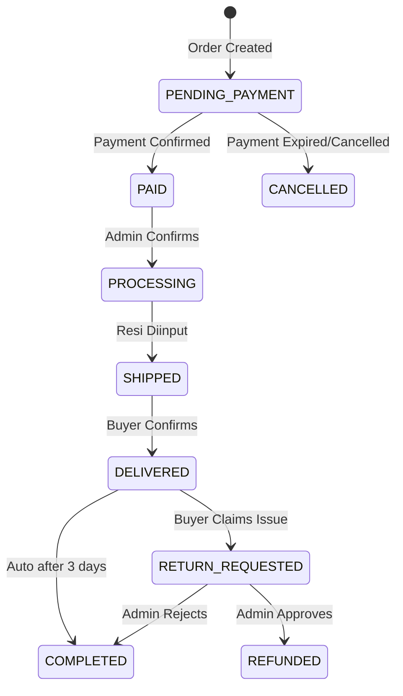

# PRD — OrchidMart: E-Commerce Platform Penjualan Anggrek

> **Versi**: 1.0  
> **Tanggal**: 17 April 2026  
> **Status**: Draft  
> **Author**: Development Team

---

## 1. Ringkasan Eksekutif

**OrchidMart** adalah platform e-commerce yang dirancang khusus untuk penjualan bibit dan tanaman anggrek, dilengkapi dengan sistem manajemen stok terintegrasi serta dashboard analisis bisnis. Platform ini menargetkan pembeli dari kalangan bisnis (nursery, reseller, florist) maupun pembeli umum (hobbyist, kolektor).

### 1.1 Tujuan Produk

| Aspek | Deskripsi |
|---|---|
| **Masalah** | Penjualan anggrek masih banyak dilakukan secara manual (WhatsApp, marketplace umum) tanpa manajemen stok dan analisis bisnis yang memadai |
| **Solusi** | Platform e-commerce khusus anggrek dengan fitur manajemen stok multi-unit dan dashboard analisis komprehensif |
| **Value Proposition** | Satu platform terintegrasi untuk penjualan, manajemen inventori, dan analisis bisnis tanaman anggrek |

### 1.2 Tech Stack

| Layer | Teknologi | Keterangan |
|---|---|---|
| **Frontend** | Next.js (App Router) | React-based SSR/SSG framework |
| **Backend** | Go (Golang) | REST API dengan Gin/Echo framework |
| **Database** | PostgreSQL | Relational database |
| **FE Deployment** | Vercel | Serverless deployment untuk Next.js |
| **BE Deployment** | VPS | Self-managed server (Linux) |
| **Object Storage** | S3-compatible (MinIO/Cloudflare R2) | Penyimpanan gambar produk |

---

## 2. Target Pengguna

### 2.1 Persona

#### Persona 1: Pembeli Bisnis (B2B)
- **Profil**: Pemilik nursery, reseller anggrek, florist
- **Kebutuhan**: Pembelian dalam jumlah besar (batch), harga grosir, faktur bisnis
- **Perilaku**: Order rutin, butuh varietas spesifik, negosiasi harga

#### Persona 2: Pembeli Umum (B2C)
- **Profil**: Hobbyist anggrek, kolektor tanaman, pembeli hadiah
- **Kebutuhan**: Varietas unik, panduan perawatan, pembelian satuan
- **Perilaku**: Browsing katalog, review produk, impulse buying

#### Persona 3: Admin / Pemilik Toko
- **Profil**: Pemilik bisnis anggrek, staff operasional
- **Kebutuhan**: Kelola stok, pantau penjualan, analisis tren
- **Perilaku**: Daily monitoring dashboard, update stok, proses pesanan

### 2.2 Matriks Akses

| Fitur | Pembeli (Guest) | Pembeli (Registered) | Admin |
|---|:---:|:---:|:---:|
| Browse katalog | ✅ | ✅ | ✅ |
| Keranjang & checkout | ❌ | ✅ | ❌ |
| Riwayat pesanan | ❌ | ✅ | ✅ |
| Manajemen stok | ❌ | ❌ | ✅ |
| Dashboard analisis | ❌ | ❌ | ✅ |
| Kelola produk | ❌ | ❌ | ✅ |
| Kelola pesanan | ❌ | ❌ | ✅ |

---

## 3. Fitur & Requirement Detail

### 3.1 Modul Storefront (Customer-Facing)

#### 3.1.1 Autentikasi & Akun Pengguna

| ID | Requirement | Prioritas |
|---|---|---|
| AUTH-01 | Registrasi dengan email & password | P0 |
| AUTH-02 | Login / Logout | P0 |
| AUTH-03 | Lupa password (reset via email) | P1 |
| AUTH-04 | Profil pengguna (nama, alamat, telepon) | P0 |
| AUTH-05 | Manajemen multiple alamat pengiriman | P1 |
| AUTH-06 | Login dengan Google OAuth | P2 |

**Detail Teknis:**
- JWT-based authentication (access token + refresh token)
- Access token TTL: 15 menit
- Refresh token TTL: 7 hari
- Password hashing: bcrypt (cost factor 12)
- Rate limiting: 5 login attempts / 15 menit

#### 3.1.2 Katalog Produk

| ID | Requirement | Prioritas |
|---|---|---|
| CAT-01 | Listing produk dengan gambar, nama, harga, dan stok tersedia | P0 |
| CAT-02 | Detail produk: deskripsi, spesifikasi, gallery gambar (multi-image) | P0 |
| CAT-03 | Kategori produk (Phalaenopsis, Dendrobium, Vanda, Cattleya, Oncidium, dll) | P0 |
| CAT-04 | Filter berdasarkan: kategori, harga, ukuran, ketersediaan stok | P0 |
| CAT-05 | Sorting: terbaru, harga terendah, harga tertinggi, terlaris | P0 |
| CAT-06 | Search produk (nama, varietas) | P0 |
| CAT-07 | Tag produk (rare, bestseller, new arrival, promo) | P1 |
| CAT-08 | Pagination / infinite scroll | P0 |
| CAT-09 | Wishlist / simpan favorit | P2 |

**Spesifikasi Produk yang Ditampilkan:**

```
- Nama Produk
- Nama Varietas (Latin & Lokal)
- Kategori / Genus
- Deskripsi lengkap
- Harga (per pohon / per batch)
- Ukuran tanaman (seedling, remaja, dewasa, berbunga)
- Kondisi (berbunga, knop, vegetatif)
- Jumlah stok tersedia
- Gambar produk (max 8 gambar)
- Berat estimasi (untuk kalkulasi ongkir)
- Tips perawatan singkat
```

#### 3.1.3 Keranjang Belanja

| ID | Requirement | Prioritas |
|---|---|---|
| CART-01 | Tambah produk ke keranjang | P0 |
| CART-02 | Update jumlah item | P0 |
| CART-03 | Hapus item dari keranjang | P0 |
| CART-04 | Validasi stok real-time saat checkout | P0 |
| CART-05 | Persistent cart (tersimpan di database untuk user login) | P1 |
| CART-06 | Catatan per-item (request khusus) | P2 |

#### 3.1.4 Checkout & Pembayaran

| ID | Requirement | Prioritas |
|---|---|---|
| PAY-01 | Pilih alamat pengiriman | P0 |
| PAY-02 | Pilih ekspedisi pengiriman | P0 |
| PAY-03 | Kalkulasi ongkos kirim otomatis | P0 |
| PAY-04 | Ringkasan pesanan sebelum bayar | P0 |
| PAY-05 | Pembayaran via Transfer Bank (manual confirm) | P0 |
| PAY-06 | Pembayaran via E-Wallet (GoPay, OVO, DANA, ShopeePay) | P0 |
| PAY-07 | Pembayaran via Kartu Kredit/Debit | P1 |
| PAY-08 | Pembayaran COD (Cash on Delivery) | P1 |
| PAY-09 | Upload bukti transfer (untuk transfer bank manual) | P0 |
| PAY-10 | Kode kupon / voucher diskon | P2 |
| PAY-11 | Batas waktu pembayaran: 24 jam | P0 |

**Payment Gateway Integration:**
- **Primary**: Midtrans (mendukung semua metode pembayaran)
- **Fallback**: Xendit
- Transfer Bank: BCA, BNI, BRI, Mandiri (Virtual Account)
- E-Wallet: GoPay, OVO, DANA, ShopeePay
- Kartu Kredit: Visa, Mastercard
- COD: tersedia untuk area tertentu dengan batas maksimum order

**Status Pembayaran:**
```
PENDING → PAID → (atau) EXPIRED → CANCELLED
                ↓
           REFUNDED (jika ada retur)
```

#### 3.1.5 Pengiriman

| ID | Requirement | Prioritas |
|---|---|---|
| SHIP-01 | Integrasi API RajaOngkir / Biteship untuk cek ongkir | P0 |
| SHIP-02 | Pilihan ekspedisi: JNE, J&T, SiCepat, AnterAja, POS Indonesia | P0 |
| SHIP-03 | Pilihan layanan per ekspedisi (REG, YES, OKE, dll) | P0 |
| SHIP-04 | Input resi pengiriman oleh admin | P0 |
| SHIP-05 | Tracking pengiriman real-time | P1 |
| SHIP-06 | Estimasi waktu pengiriman | P0 |
| SHIP-07 | Catatan khusus pengiriman tanaman hidup | P0 |
| SHIP-08 | Asuransi pengiriman (opsional) | P2 |

**Catatan Pengiriman Tanaman Hidup:**

> [!IMPORTANT]
> Pengiriman tanaman hidup memerlukan penanganan khusus. Sistem harus:
> - Menampilkan disclaimer risiko pengiriman tanaman hidup
> - Opsi packing premium (tambahan biaya) dengan perlindungan ekstra
> - Rekomendasi layanan pengiriman kilat untuk jarak jauh
> - Notice bahwa garansi kerusakan hanya berlaku dengan bukti unboxing video

#### 3.1.6 Pesanan & Riwayat

| ID | Requirement | Prioritas |
|---|---|---|
| ORD-01 | Daftar pesanan dengan status | P0 |
| ORD-02 | Detail pesanan lengkap | P0 |
| ORD-03 | Konfirmasi penerimaan barang | P0 |
| ORD-04 | Notifikasi update status pesanan (email) | P1 |
| ORD-05 | Review & rating produk setelah pesanan selesai | P2 |

**Alur Status Pesanan:**



---

### 3.2 Modul Admin Panel

#### 3.2.1 Manajemen Produk

| ID | Requirement | Prioritas |
|---|---|---|
| APROD-01 | CRUD produk (nama, deskripsi, harga, kategori, gambar) | P0 |
| APROD-02 | Upload multiple gambar per produk | P0 |
| APROD-03 | CRUD kategori produk | P0 |
| APROD-04 | Atur status produk (aktif/nonaktif/draft) | P0 |
| APROD-05 | Duplikat produk (untuk variasi serupa) | P2 |
| APROD-06 | Bulk update harga | P2 |

#### 3.2.2 Manajemen Stok / Inventori

| ID | Requirement | Prioritas |
|---|---|---|
| STK-01 | Tracking stok berdasarkan jumlah (quantity) | P0 |
| STK-02 | Unit inventori: Per Pohon, Per Batch, Per Varietas | P0 |
| STK-03 | Update stok manual (tambah/kurang) | P0 |
| STK-04 | Riwayat perubahan stok (stock movement log) | P0 |
| STK-05 | Alert stok rendah (low stock warning threshold) | P1 |
| STK-06 | Auto-reduce stok saat order terbayar | P0 |
| STK-07 | Auto-restore stok saat order dibatalkan/expired | P0 |
| STK-08 | Stok overview: total item, total nilai inventori | P1 |

**Detail Unit Inventori:**

| Unit | Penjelasan | Contoh |
|---|---|---|
| **Per Pohon** | Satuan individual tanaman | "Phalaenopsis Amabilis - 25 pohon" |
| **Per Batch** | Kelompok tanaman dalam satu lot | "Dendrobium Seedling Batch A - 3 batch (@ 50 pohon)" |
| **Per Varietas** | Tracking per jenis varietas | "Vanda Tricolor - 10 varietas tersedia" |

**Skema Stock Movement:**
```
Tipe Movement:
- STOCK_IN    → Penambahan stok (restock, retur masuk)
- STOCK_OUT   → Pengurangan stok (penjualan, rusak, hadiah)
- ADJUSTMENT  → Koreksi stok (stock opname)

Log Fields:
- product_id
- movement_type (STOCK_IN | STOCK_OUT | ADJUSTMENT)
- quantity (+ atau -)
- unit_type (PER_POHON | PER_BATCH | PER_VARIETAS)
- reference (order_id / adjustment note)
- performed_by (admin_id)
- created_at
```

#### 3.2.3 Manajemen Pesanan

| ID | Requirement | Prioritas |
|---|---|---|
| AORD-01 | Daftar semua pesanan dengan filter status | P0 |
| AORD-02 | Detail pesanan & info pembeli | P0 |
| AORD-03 | Update status pesanan | P0 |
| AORD-04 | Konfirmasi pembayaran manual (transfer bank) | P0 |
| AORD-05 | Input nomor resi pengiriman | P0 |
| AORD-06 | Proses retur/refund | P1 |
| AORD-07 | Cetak invoice / packing slip | P2 |
| AORD-08 | Filter & search pesanan (tanggal, status, customer) | P0 |

#### 3.2.4 Manajemen Pelanggan

| ID | Requirement | Prioritas |
|---|---|---|
| ACUST-01 | Daftar pelanggan terdaftar | P0 |
| ACUST-02 | Detail pelanggan & riwayat order | P0 |
| ACUST-03 | Segmentasi: B2B vs B2C | P1 |
| ACUST-04 | Blacklist / suspend akun | P2 |

---

### 3.3 Modul Dashboard Analisis

> [!NOTE]
> Dashboard analisis hanya dapat diakses oleh Admin. Semua data ditampilkan dengan opsi filter periode waktu (hari ini, 7 hari, 30 hari, 3 bulan, 6 bulan, 1 tahun, custom range).

#### 3.3.1 Analisis Penjualan

| ID | Requirement | Prioritas |
|---|---|---|
| DASH-S01 | Total revenue (periode tertentu) | P0 |
| DASH-S02 | Jumlah transaksi sukses | P0 |
| DASH-S03 | Rata-rata nilai order (AOV) | P0 |
| DASH-S04 | Grafik penjualan harian/mingguan/bulanan (line/bar chart) | P0 |
| DASH-S05 | Produk terlaris (top 10) | P0 |
| DASH-S06 | Kategori terlaris | P1 |
| DASH-S07 | Revenue breakdown per metode pembayaran | P1 |
| DASH-S08 | Perbandingan periode (MoM, YoY) | P2 |

**KPI Cards (Overview):**
```
┌──────────────┐ ┌──────────────┐ ┌──────────────┐ ┌──────────────┐
│ Total Revenue│ │  Total Order │ │   AOV        │ │ Conversion   │
│ Rp XX.XXX.XXX│ │     XXX      │ │ Rp XXX.XXX   │ │   X.X%       │
│   ▲ +12%     │ │   ▲ +8%      │ │   ▼ -3%      │ │   ▲ +2%      │
└──────────────┘ └──────────────┘ └──────────────┘ └──────────────┘
```

#### 3.3.2 Analisis Stok

| ID | Requirement | Prioritas |
|---|---|---|
| DASH-I01 | Total item dalam inventori | P0 |
| DASH-I02 | Total nilai inventori (harga jual) | P1 |
| DASH-I03 | Produk dengan stok rendah (below threshold) | P0 |
| DASH-I04 | Produk habis (out of stock) | P0 |
| DASH-I05 | Stock turnover rate | P1 |
| DASH-I06 | Grafik movement stok | P1 |
| DASH-I07 | Alert produk yang perlu restock | P0 |

#### 3.3.3 Analisis Pelanggan

| ID | Requirement | Prioritas |
|---|---|---|
| DASH-C01 | Total pelanggan terdaftar | P0 |
| DASH-C02 | Pelanggan baru vs returning | P0 |
| DASH-C03 | Top customers (by total spending) | P1 |
| DASH-C04 | Distribusi geografis pelanggan (by kota/provinsi) | P1 |
| DASH-C05 | Customer lifetime value (CLV) rata-rata | P2 |
| DASH-C06 | Retention rate | P2 |

#### 3.3.4 Analisis Tren

| ID | Requirement | Prioritas |
|---|---|---|
| DASH-T01 | Tren penjualan per kategori anggrek (time series) | P0 |
| DASH-T02 | Varietas/produk yang sedang naik daun (trending up) | P1 |
| DASH-T03 | Seasonal pattern (pola musiman penjualan) | P1 |
| DASH-T04 | Prediksi demand sederhana (based on historical data) | P2 |
| DASH-T05 | Tren metode pembayaran yang digunakan | P2 |
| DASH-T06 | Tren ekspedisi yang dipilih pembeli | P2 |

---

## 4. Arsitektur Sistem

### 4.1 High-Level Architecture

```
┌─────────────────────────────────────────────────────────────────┐
│                        CLIENT LAYER                             │
│                                                                 │
│  ┌─────────────────┐         ┌─────────────────┐               │
│  │   Storefront     │         │   Admin Panel    │              │
│  │   (Next.js)      │         │   (Next.js)      │              │
│  │   Vercel         │         │   Vercel         │              │
│  └────────┬─────────┘         └────────┬─────────┘              │
│           │                            │                        │
└───────────┼────────────────────────────┼────────────────────────┘
            │         HTTPS              │
            ▼                            ▼
┌─────────────────────────────────────────────────────────────────┐
│                        API LAYER (VPS)                          │
│                                                                 │
│  ┌──────────────────────────────────────────────────────┐       │
│  │              Go REST API Server                       │      │
│  │        (Gin/Echo + GORM/sqlx)                         │      │
│  │                                                        │     │
│  │  ┌──────────┐ ┌──────────┐ ┌──────────┐ ┌──────────┐ │     │
│  │  │   Auth   │ │ Product  │ │  Order   │ │Analytics │ │     │
│  │  │ Service  │ │ Service  │ │ Service  │ │ Service  │ │     │
│  │  └──────────┘ └──────────┘ └──────────┘ └──────────┘ │     │
│  └───────────────────────┬──────────────────────────────┘      │
│                          │                                      │
│  ┌───────────────────────┼──────────────────────────────┐      │
│  │                       ▼                               │      │
│  │              PostgreSQL Database                      │      │
│  │                                                       │      │
│  └───────────────────────────────────────────────────────┘      │
│                                                                 │
│  ┌────────────┐  ┌────────────┐  ┌─────────────────┐          │
│  │   Redis    │  │   MinIO    │  │   SMTP Server   │          │
│  │  (Cache)   │  │  (Images)  │  │   (Email)       │          │
│  └────────────┘  └────────────┘  └─────────────────┘          │
│                                                                 │
└─────────────────────────────────────────────────────────────────┘

         ┌──────────────────────────────────────┐
         │         EXTERNAL SERVICES            │
         │                                      │
         │  Midtrans (Payment)                  │
         │  RajaOngkir/Biteship (Shipping)      │
         │  SMTP (Mailtrap/SendGrid)            │
         │                                      │
         └──────────────────────────────────────┘
```

### 4.2 Frontend Architecture (Next.js)

```
frontend/
├── public/
│   ├── images/
│   └── fonts/
├── src/
│   ├── app/                      # App Router
│   │   ├── (storefront)/         # Route Group: Customer
│   │   │   ├── page.tsx          # Homepage
│   │   │   ├── products/
│   │   │   │   ├── page.tsx      # Product listing
│   │   │   │   └── [slug]/
│   │   │   │       └── page.tsx  # Product detail
│   │   │   ├── cart/
│   │   │   │   └── page.tsx
│   │   │   ├── checkout/
│   │   │   │   └── page.tsx
│   │   │   ├── orders/
│   │   │   │   ├── page.tsx
│   │   │   │   └── [id]/
│   │   │   │       └── page.tsx
│   │   │   └── profile/
│   │   │       └── page.tsx
│   │   ├── (auth)/               # Route Group: Auth
│   │   │   ├── login/
│   │   │   │   └── page.tsx
│   │   │   ├── register/
│   │   │   │   └── page.tsx
│   │   │   └── forgot-password/
│   │   │       └── page.tsx
│   │   ├── admin/                # Route Group: Admin
│   │   │   ├── layout.tsx        # Admin layout with sidebar
│   │   │   ├── page.tsx          # Dashboard overview
│   │   │   ├── products/
│   │   │   ├── orders/
│   │   │   ├── inventory/
│   │   │   ├── customers/
│   │   │   └── analytics/
│   │   │       ├── sales/
│   │   │       ├── stock/
│   │   │       ├── customers/
│   │   │       └── trends/
│   │   ├── layout.tsx
│   │   └── globals.css
│   ├── components/
│   │   ├── ui/                   # Reusable UI components
│   │   ├── storefront/           # Store-specific components
│   │   └── admin/                # Admin-specific components
│   ├── lib/
│   │   ├── api.ts                # API client (axios/fetch wrapper)
│   │   ├── auth.ts               # Auth utilities
│   │   └── utils.ts
│   ├── hooks/                    # Custom React hooks
│   ├── store/                    # Zustand state management
│   └── types/                    # TypeScript type definitions
├── next.config.js
├── tsconfig.json
└── package.json
```

**Frontend Key Libraries:**

| Library | Fungsi |
|---|---|
| `next` (v14+) | Framework utama |
| `typescript` | Type safety |
| `zustand` | State management (ringan) |
| `axios` | HTTP client |
| `recharts` / `chart.js` | Grafik dashboard |
| `react-hook-form` + `zod` | Form handling & validation |
| `next-auth` | Authentication |
| `sonner` | Toast notifications |
| `lucide-react` | Icon set |
| `date-fns` | Date formatting |

### 4.3 Backend Architecture (Go)

```
backend/
├── cmd/
│   └── server/
│       └── main.go               # Entry point
├── internal/
│   ├── config/                    # Configuration management
│   │   └── config.go
│   ├── middleware/                 # HTTP middleware
│   │   ├── auth.go
│   │   ├── cors.go
│   │   ├── logger.go
│   │   └── ratelimit.go
│   ├── handler/                   # HTTP handlers (controllers)
│   │   ├── auth_handler.go
│   │   ├── product_handler.go
│   │   ├── cart_handler.go
│   │   ├── order_handler.go
│   │   ├── payment_handler.go
│   │   ├── inventory_handler.go
│   │   ├── customer_handler.go
│   │   └── analytics_handler.go
│   ├── service/                   # Business logic
│   │   ├── auth_service.go
│   │   ├── product_service.go
│   │   ├── cart_service.go
│   │   ├── order_service.go
│   │   ├── payment_service.go
│   │   ├── inventory_service.go
│   │   ├── shipping_service.go
│   │   └── analytics_service.go
│   ├── repository/                # Data access layer
│   │   ├── user_repo.go
│   │   ├── product_repo.go
│   │   ├── order_repo.go
│   │   ├── inventory_repo.go
│   │   └── analytics_repo.go
│   ├── model/                     # Database models
│   │   ├── user.go
│   │   ├── product.go
│   │   ├── category.go
│   │   ├── cart.go
│   │   ├── order.go
│   │   ├── payment.go
│   │   ├── inventory.go
│   │   └── stock_movement.go
│   ├── dto/                       # Data transfer objects
│   │   ├── request/
│   │   └── response/
│   └── pkg/                       # Shared utilities
│       ├── validator/
│       ├── response/
│       └── helper/
├── migrations/                    # Database migrations
│   ├── 001_create_users.sql
│   ├── 002_create_products.sql
│   └── ...
├── docs/                          # API documentation (Swagger)
├── go.mod
├── go.sum
├── Makefile
├── Dockerfile
└── .env.example
```

**Backend Key Libraries:**

| Library | Fungsi |
|---|---|
| `gin-gonic/gin` atau `labstack/echo` | HTTP framework |
| `gorm.io/gorm` | ORM |
| `golang-jwt/jwt` | JWT token |
| `golang-migrate/migrate` | DB migration |
| `go-playground/validator` | Request validation |
| `swaggo/swag` | Swagger API docs |
| `redis/go-redis` | Redis client |
| `aws/aws-sdk-go-v2` | S3-compatible storage |
| `robfig/cron` | Scheduled tasks |
| `rs/zerolog` | Structured logging |

### 4.4 Database Schema (PostgreSQL)

```sql
-- =============================================
-- USERS & AUTH
-- =============================================

CREATE TABLE users (
    id              UUID PRIMARY KEY DEFAULT gen_random_uuid(),
    email           VARCHAR(255) UNIQUE NOT NULL,
    password_hash   VARCHAR(255) NOT NULL,
    full_name       VARCHAR(255) NOT NULL,
    phone           VARCHAR(20),
    role            VARCHAR(20) DEFAULT 'customer', -- 'customer' | 'admin'
    customer_type   VARCHAR(10) DEFAULT 'B2C',      -- 'B2B' | 'B2C'
    is_active       BOOLEAN DEFAULT true,
    created_at      TIMESTAMP DEFAULT NOW(),
    updated_at      TIMESTAMP DEFAULT NOW()
);

CREATE TABLE addresses (
    id              UUID PRIMARY KEY DEFAULT gen_random_uuid(),
    user_id         UUID REFERENCES users(id) ON DELETE CASCADE,
    label           VARCHAR(50),          -- 'Rumah', 'Kantor', 'Nursery'
    recipient_name  VARCHAR(255) NOT NULL,
    phone           VARCHAR(20) NOT NULL,
    province        VARCHAR(100) NOT NULL,
    city            VARCHAR(100) NOT NULL,
    district        VARCHAR(100) NOT NULL,
    postal_code     VARCHAR(10) NOT NULL,
    full_address    TEXT NOT NULL,
    is_default      BOOLEAN DEFAULT false,
    created_at      TIMESTAMP DEFAULT NOW()
);

-- =============================================
-- PRODUCTS & CATEGORIES
-- =============================================

CREATE TABLE categories (
    id              UUID PRIMARY KEY DEFAULT gen_random_uuid(),
    name            VARCHAR(100) NOT NULL,   -- 'Phalaenopsis', 'Dendrobium'
    slug            VARCHAR(100) UNIQUE NOT NULL,
    description     TEXT,
    image_url       VARCHAR(500),
    parent_id       UUID REFERENCES categories(id),
    sort_order      INT DEFAULT 0,
    is_active       BOOLEAN DEFAULT true,
    created_at      TIMESTAMP DEFAULT NOW()
);

CREATE TABLE products (
    id              UUID PRIMARY KEY DEFAULT gen_random_uuid(),
    category_id     UUID REFERENCES categories(id),
    name            VARCHAR(255) NOT NULL,
    slug            VARCHAR(255) UNIQUE NOT NULL,
    variety_name    VARCHAR(255),             -- Nama varietas (Latin)
    description     TEXT,
    price           DECIMAL(12,2) NOT NULL,
    weight_gram     INT NOT NULL DEFAULT 500, -- Berat estimasi untuk ongkir
    size            VARCHAR(50),              -- 'seedling','remaja','dewasa','berbunga'
    condition       VARCHAR(50),              -- 'berbunga','knop','vegetatif'
    unit_type       VARCHAR(20) NOT NULL,     -- 'PER_POHON','PER_BATCH','PER_VARIETAS'
    batch_quantity  INT DEFAULT 1,            -- Jumlah per batch (jika unit = PER_BATCH)
    care_tips       TEXT,                     -- Tips perawatan
    tags            TEXT[],                   -- {'rare','bestseller','new_arrival','promo'}
    status          VARCHAR(20) DEFAULT 'active', -- 'active','inactive','draft'
    created_at      TIMESTAMP DEFAULT NOW(),
    updated_at      TIMESTAMP DEFAULT NOW()
);

CREATE TABLE product_images (
    id              UUID PRIMARY KEY DEFAULT gen_random_uuid(),
    product_id      UUID REFERENCES products(id) ON DELETE CASCADE,
    image_url       VARCHAR(500) NOT NULL,
    alt_text        VARCHAR(255),
    sort_order      INT DEFAULT 0,
    is_primary      BOOLEAN DEFAULT false,
    created_at      TIMESTAMP DEFAULT NOW()
);

-- =============================================
-- INVENTORY / STOCK
-- =============================================

CREATE TABLE inventory (
    id              UUID PRIMARY KEY DEFAULT gen_random_uuid(),
    product_id      UUID UNIQUE REFERENCES products(id) ON DELETE CASCADE,
    quantity         INT NOT NULL DEFAULT 0,
    low_stock_threshold INT DEFAULT 5,
    updated_at      TIMESTAMP DEFAULT NOW()
);

CREATE TABLE stock_movements (
    id              UUID PRIMARY KEY DEFAULT gen_random_uuid(),
    product_id      UUID REFERENCES products(id),
    movement_type   VARCHAR(20) NOT NULL,    -- 'STOCK_IN','STOCK_OUT','ADJUSTMENT'
    quantity         INT NOT NULL,            -- Bisa positif atau negatif
    reference_type  VARCHAR(50),             -- 'ORDER','MANUAL','RETURN','OPNAME'
    reference_id    VARCHAR(100),            -- order_id atau keterangan
    note            TEXT,
    performed_by    UUID REFERENCES users(id),
    created_at      TIMESTAMP DEFAULT NOW()
);

-- =============================================
-- CART
-- =============================================

CREATE TABLE carts (
    id              UUID PRIMARY KEY DEFAULT gen_random_uuid(),
    user_id         UUID UNIQUE REFERENCES users(id) ON DELETE CASCADE,
    created_at      TIMESTAMP DEFAULT NOW(),
    updated_at      TIMESTAMP DEFAULT NOW()
);

CREATE TABLE cart_items (
    id              UUID PRIMARY KEY DEFAULT gen_random_uuid(),
    cart_id         UUID REFERENCES carts(id) ON DELETE CASCADE,
    product_id      UUID REFERENCES products(id),
    quantity         INT NOT NULL DEFAULT 1,
    note            TEXT,                     -- Catatan item
    created_at      TIMESTAMP DEFAULT NOW(),
    UNIQUE(cart_id, product_id)
);

-- =============================================
-- ORDERS & PAYMENTS
-- =============================================

CREATE TABLE orders (
    id              UUID PRIMARY KEY DEFAULT gen_random_uuid(),
    order_number    VARCHAR(50) UNIQUE NOT NULL, -- 'ORD-20260417-XXXX'
    user_id         UUID REFERENCES users(id),
    
    -- Alamat snapshot (disalin saat order, bukan reference)
    shipping_name       VARCHAR(255) NOT NULL,
    shipping_phone      VARCHAR(20) NOT NULL,
    shipping_address    TEXT NOT NULL,
    shipping_city       VARCHAR(100) NOT NULL,
    shipping_province   VARCHAR(100) NOT NULL,
    shipping_postal_code VARCHAR(10) NOT NULL,
    
    -- Pengiriman
    courier_code    VARCHAR(20),              -- 'jne','jnt','sicepat'
    courier_service VARCHAR(50),              -- 'REG','YES','OKE'
    shipping_cost   DECIMAL(12,2) DEFAULT 0,
    tracking_number VARCHAR(100),
    
    -- Harga
    subtotal        DECIMAL(12,2) NOT NULL,
    discount        DECIMAL(12,2) DEFAULT 0,
    total           DECIMAL(12,2) NOT NULL,
    
    -- Status
    status          VARCHAR(30) DEFAULT 'PENDING_PAYMENT',
    note            TEXT,                     -- Catatan dari buyer
    admin_note      TEXT,                     -- Catatan internal admin
    
    -- Timestamps
    paid_at         TIMESTAMP,
    shipped_at      TIMESTAMP,
    delivered_at    TIMESTAMP,
    completed_at    TIMESTAMP,
    cancelled_at    TIMESTAMP,
    created_at      TIMESTAMP DEFAULT NOW(),
    updated_at      TIMESTAMP DEFAULT NOW()
);

CREATE TABLE order_items (
    id              UUID PRIMARY KEY DEFAULT gen_random_uuid(),
    order_id        UUID REFERENCES orders(id) ON DELETE CASCADE,
    product_id      UUID REFERENCES products(id),
    product_name    VARCHAR(255) NOT NULL,    -- Snapshot nama produk
    product_price   DECIMAL(12,2) NOT NULL,   -- Snapshot harga saat order
    quantity         INT NOT NULL,
    subtotal        DECIMAL(12,2) NOT NULL,
    created_at      TIMESTAMP DEFAULT NOW()
);

CREATE TABLE payments (
    id              UUID PRIMARY KEY DEFAULT gen_random_uuid(),
    order_id        UUID REFERENCES orders(id),
    method          VARCHAR(30) NOT NULL,     -- 'bank_transfer','ewallet','credit_card','cod'
    provider        VARCHAR(50),              -- 'midtrans','manual'
    external_id     VARCHAR(255),             -- ID dari payment gateway
    amount          DECIMAL(12,2) NOT NULL,
    status          VARCHAR(20) DEFAULT 'PENDING', -- 'PENDING','PAID','EXPIRED','REFUNDED'
    payment_url     VARCHAR(500),             -- URL redirect ke payment gateway
    proof_image_url VARCHAR(500),             -- Bukti transfer (manual)
    paid_at         TIMESTAMP,
    expired_at      TIMESTAMP,
    created_at      TIMESTAMP DEFAULT NOW(),
    updated_at      TIMESTAMP DEFAULT NOW()
);

-- =============================================
-- REVIEWS
-- =============================================

CREATE TABLE reviews (
    id              UUID PRIMARY KEY DEFAULT gen_random_uuid(),
    product_id      UUID REFERENCES products(id),
    user_id         UUID REFERENCES users(id),
    order_id        UUID REFERENCES orders(id),
    rating          INT CHECK (rating >= 1 AND rating <= 5),
    comment         TEXT,
    created_at      TIMESTAMP DEFAULT NOW()
);

-- =============================================
-- COUPONS
-- =============================================

CREATE TABLE coupons (
    id              UUID PRIMARY KEY DEFAULT gen_random_uuid(),
    code            VARCHAR(50) UNIQUE NOT NULL,
    description     TEXT,
    discount_type   VARCHAR(20) NOT NULL,     -- 'percentage' | 'fixed'
    discount_value  DECIMAL(12,2) NOT NULL,
    min_purchase    DECIMAL(12,2) DEFAULT 0,
    max_discount    DECIMAL(12,2),
    usage_limit     INT,
    used_count      INT DEFAULT 0,
    valid_from      TIMESTAMP NOT NULL,
    valid_until     TIMESTAMP NOT NULL,
    is_active       BOOLEAN DEFAULT true,
    created_at      TIMESTAMP DEFAULT NOW()
);

-- =============================================
-- INDEXES
-- =============================================

CREATE INDEX idx_products_category ON products(category_id);
CREATE INDEX idx_products_status ON products(status);
CREATE INDEX idx_products_slug ON products(slug);
CREATE INDEX idx_orders_user ON orders(user_id);
CREATE INDEX idx_orders_status ON orders(status);
CREATE INDEX idx_orders_created ON orders(created_at);
CREATE INDEX idx_stock_movements_product ON stock_movements(product_id);
CREATE INDEX idx_stock_movements_created ON stock_movements(created_at);
CREATE INDEX idx_payments_order ON payments(order_id);
CREATE INDEX idx_payments_status ON payments(status);
CREATE INDEX idx_reviews_product ON reviews(product_id);
```

---

## 5. API Endpoints

### 5.1 Authentication

| Method | Endpoint | Deskripsi |
|---|---|---|
| POST | `/api/v1/auth/register` | Registrasi user baru |
| POST | `/api/v1/auth/login` | Login, return JWT |
| POST | `/api/v1/auth/refresh` | Refresh access token |
| POST | `/api/v1/auth/forgot-password` | Request password reset |
| POST | `/api/v1/auth/reset-password` | Reset password dengan token |
| GET | `/api/v1/auth/me` | Get current user profile |

### 5.2 Products (Public)

| Method | Endpoint | Deskripsi |
|---|---|---|
| GET | `/api/v1/products` | List produk (+ filter, sort, pagination) |
| GET | `/api/v1/products/:slug` | Detail produk by slug |
| GET | `/api/v1/categories` | List semua kategori |
| GET | `/api/v1/categories/:slug/products` | Produk per kategori |

### 5.3 Cart (Authenticated)

| Method | Endpoint | Deskripsi |
|---|---|---|
| GET | `/api/v1/cart` | Get cart items |
| POST | `/api/v1/cart/items` | Tambah item ke cart |
| PUT | `/api/v1/cart/items/:id` | Update quantity item |
| DELETE | `/api/v1/cart/items/:id` | Hapus item dari cart |
| DELETE | `/api/v1/cart` | Clear cart |

### 5.4 Orders (Authenticated)

| Method | Endpoint | Deskripsi |
|---|---|---|
| POST | `/api/v1/orders` | Buat order baru (checkout) |
| GET | `/api/v1/orders` | List order milik user |
| GET | `/api/v1/orders/:id` | Detail order |
| POST | `/api/v1/orders/:id/confirm-delivery` | Konfirmasi terima barang |

### 5.5 Payment

| Method | Endpoint | Deskripsi |
|---|---|---|
| POST | `/api/v1/payments/:order_id/pay` | Initiate payment |
| POST | `/api/v1/payments/:order_id/upload-proof` | Upload bukti transfer |
| POST | `/api/v1/payments/webhook/midtrans` | Webhook dari Midtrans |
| GET | `/api/v1/payments/:order_id/status` | Cek status pembayaran |

### 5.6 Shipping

| Method | Endpoint | Deskripsi |
|---|---|---|
| GET | `/api/v1/shipping/provinces` | List provinsi |
| GET | `/api/v1/shipping/cities/:province_id` | List kota/kabupaten |
| POST | `/api/v1/shipping/cost` | Hitung ongkos kirim |

### 5.7 Address (Authenticated)

| Method | Endpoint | Deskripsi |
|---|---|---|
| GET | `/api/v1/addresses` | List alamat user |
| POST | `/api/v1/addresses` | Tambah alamat baru |
| PUT | `/api/v1/addresses/:id` | Update alamat |
| DELETE | `/api/v1/addresses/:id` | Hapus alamat |
| PUT | `/api/v1/addresses/:id/default` | Set sebagai default |

### 5.8 Reviews (Authenticated)

| Method | Endpoint | Deskripsi |
|---|---|---|
| POST | `/api/v1/products/:id/reviews` | Tambah review |
| GET | `/api/v1/products/:id/reviews` | List review produk |

### 5.9 Admin — Products

| Method | Endpoint | Deskripsi |
|---|---|---|
| GET | `/api/v1/admin/products` | List semua produk (admin view) |
| POST | `/api/v1/admin/products` | Create produk baru |
| PUT | `/api/v1/admin/products/:id` | Update produk |
| DELETE | `/api/v1/admin/products/:id` | Delete produk (soft delete) |
| POST | `/api/v1/admin/products/:id/images` | Upload gambar produk |
| DELETE | `/api/v1/admin/products/:id/images/:image_id` | Hapus gambar |
| POST | `/api/v1/admin/categories` | Create kategori |
| PUT | `/api/v1/admin/categories/:id` | Update kategori |
| DELETE | `/api/v1/admin/categories/:id` | Delete kategori |

### 5.10 Admin — Orders

| Method | Endpoint | Deskripsi |
|---|---|---|
| GET | `/api/v1/admin/orders` | List semua order (+ filter) |
| GET | `/api/v1/admin/orders/:id` | Detail order |
| PUT | `/api/v1/admin/orders/:id/status` | Update status order |
| PUT | `/api/v1/admin/orders/:id/tracking` | Input resi |
| POST | `/api/v1/admin/orders/:id/confirm-payment` | Konfirmasi bayar manual |

### 5.11 Admin — Inventory

| Method | Endpoint | Deskripsi |
|---|---|---|
| GET | `/api/v1/admin/inventory` | List stok semua produk |
| PUT | `/api/v1/admin/inventory/:product_id` | Update stok manual |
| GET | `/api/v1/admin/inventory/movements` | Riwayat stock movement |
| GET | `/api/v1/admin/inventory/low-stock` | Produk stok rendah |

### 5.12 Admin — Customers

| Method | Endpoint | Deskripsi |
|---|---|---|
| GET | `/api/v1/admin/customers` | List pelanggan |
| GET | `/api/v1/admin/customers/:id` | Detail pelanggan + order history |

### 5.13 Admin — Analytics

| Method | Endpoint | Deskripsi |
|---|---|---|
| GET | `/api/v1/admin/analytics/sales` | Data analisis penjualan |
| GET | `/api/v1/admin/analytics/sales/summary` | KPI summary cards |
| GET | `/api/v1/admin/analytics/sales/chart` | Data grafik penjualan |
| GET | `/api/v1/admin/analytics/sales/top-products` | Produk terlaris |
| GET | `/api/v1/admin/analytics/inventory` | Data analisis stok |
| GET | `/api/v1/admin/analytics/customers` | Data analisis pelanggan |
| GET | `/api/v1/admin/analytics/trends` | Data analisis tren |

**Query Parameters untuk Analytics:**
```
?period=7d|30d|3m|6m|1y|custom
&start_date=2026-01-01
&end_date=2026-04-17
&group_by=day|week|month
```

---

## 6. Non-Functional Requirements

### 6.1 Performance

| Metrik | Target |
|---|---|
| Page Load Time (FE) | < 3 detik (LCP) |
| API Response Time | < 500ms (P95) |
| Database Query Time | < 100ms (P95) |
| Uptime | 99.5% |
| Concurrent Users | 100+ |

### 6.2 Security

| Area | Requirement |
|---|---|
| Authentication | JWT dengan refresh token rotation |
| Password | Bcrypt hashing, minimum 8 karakter |
| API | Rate limiting (100 req/min per IP) |
| Input | Sanitasi & validasi semua input |
| SQL Injection | Parameterized queries (ORM) |
| XSS | Content Security Policy headers |
| CORS | Whitelist domain Vercel |
| HTTPS | Wajib di production |
| File Upload | Validasi tipe & ukuran file (max 5MB/image) |
| Admin | IP whitelist (opsional) |

### 6.3 Scalability

- Database: Connection pooling (pgbouncer)
- Cache: Redis untuk session, product cache, shipping rate cache
- Images: CDN via S3-compatible storage
- API: Horizontal scaling ready (stateless)

### 6.4 Monitoring & Logging

| Tool | Fungsi |
|---|---|
| Structured logging (zerolog) | Application logs |
| Prometheus + Grafana | Metrics & alerting |
| Sentry | Error tracking (FE & BE) |
| PostgreSQL slow query log | DB performance |

---

## 7. Deployment Strategy

### 7.1 Frontend (Vercel)

```json
{
  "framework": "nextjs",
  "buildCommand": "npm run build",
  "outputDirectory": ".next",
  "env": {
    "NEXT_PUBLIC_API_URL": "@api-url",
    "NEXT_PUBLIC_MIDTRANS_CLIENT_KEY": "@midtrans-client-key"
  }
}
```

**CI/CD**: Auto-deploy on push to `main` branch via Vercel Git integration.

### 7.2 Backend (VPS)

```yaml
# docker-compose.yml structure
services:
  api:
    build: .
    ports:
      - "8080:8080"
    env_file: .env
    depends_on:
      - postgres
      - redis
  
  postgres:
    image: postgres:16-alpine
    volumes:
      - pgdata:/var/lib/postgresql/data
    
  redis:
    image: redis:7-alpine

  nginx:
    image: nginx:alpine
    ports:
      - "80:80"
      - "443:443"
    # SSL via Let's Encrypt / Certbot

  minio:
    image: minio/minio
    # Object storage untuk gambar
```

**CI/CD Flow:**
```
Push to main → GitHub Actions → Build Docker Image → Push to Registry → SSH Deploy to VPS → docker-compose up -d
```

### 7.3 Environment Variables

```env
# Backend (.env)
APP_PORT=8080
APP_ENV=production

# Database
DB_HOST=localhost
DB_PORT=5432
DB_USER=orchidmart
DB_PASSWORD=<secret>
DB_NAME=orchidmart

# Redis
REDIS_HOST=localhost
REDIS_PORT=6379

# JWT
JWT_SECRET=<secret>
JWT_ACCESS_TTL=15m
JWT_REFRESH_TTL=168h

# Midtrans
MIDTRANS_SERVER_KEY=<secret>
MIDTRANS_CLIENT_KEY=<key>
MIDTRANS_IS_PRODUCTION=true

# Shipping
RAJAONGKIR_API_KEY=<key>

# Storage
S3_ENDPOINT=<minio-url>
S3_ACCESS_KEY=<key>
S3_SECRET_KEY=<secret>
S3_BUCKET=orchidmart-images

# Email
SMTP_HOST=smtp.sendgrid.net
SMTP_PORT=587
SMTP_USERNAME=apikey
SMTP_PASSWORD=<key>
SMTP_FROM=noreply@orchidmart.com
```

---

## 8. Milestones & Timeline

### Phase 1: Foundation (Minggu 1-3)

| Task | Durasi |
|---|---|
| Setup project (FE + BE + DB) | 3 hari |
| Database schema & migration | 2 hari |
| User authentication (register, login, JWT) | 3 hari |
| Basic UI layout (storefront + admin shell) | 4 hari |
| CI/CD pipeline setup | 2 hari |

### Phase 2: Core E-Commerce (Minggu 4-7)

| Task | Durasi |
|---|---|
| CRUD Produk + Kategori (Admin) | 4 hari |
| Katalog produk (Storefront) | 3 hari |
| Keranjang belanja | 3 hari |
| Checkout flow | 4 hari |
| Integrasi payment gateway (Midtrans) | 4 hari |
| Integrasi ongkir (RajaOngkir) | 3 hari |
| Order management (Admin) | 3 hari |

### Phase 3: Inventory & Customers (Minggu 8-9)

| Task | Durasi |
|---|---|
| Manajemen stok (CRUD, movement log) | 4 hari |
| Auto stock reduce/restore | 2 hari |
| Low stock alert | 1 hari |
| Manajemen pelanggan (Admin) | 3 hari |

### Phase 4: Dashboard Analytics (Minggu 10-12)

| Task | Durasi |
|---|---|
| Dashboard overview + KPI cards | 3 hari |
| Analisis penjualan + grafik | 4 hari |
| Analisis stok | 3 hari |
| Analisis pelanggan | 3 hari |
| Analisis tren | 3 hari |

### Phase 5: Polish & Launch (Minggu 13-14)

| Task | Durasi |
|---|---|
| Review & rating produk | 3 hari |
| Email notifications | 2 hari |
| UI polish & responsive testing | 3 hari |
| Security audit | 2 hari |
| Performance optimization | 2 hari |
| UAT & bug fixing | 3 hari |
| Production deployment | 1 hari |

**Total Estimasi**: ~14 minggu (3.5 bulan)

---

## 9. Risiko & Mitigasi

| Risiko | Impact | Mitigasi |
|---|---|---|
| Tanaman rusak saat pengiriman | High | Disclaimer, packing premium, rekomendasi ekspedisi kilat, kebijakan return |
| Payment gateway downtime | High | Dual gateway (Midtrans + manual transfer fallback) |
| Database data loss | Critical | Daily automated backup, point-in-time recovery |
| VPS downtime | High | Monitoring + auto-restart, health check endpoint |
| Image storage penuh | Medium | S3-compatible storage dengan scaling, image compression |
| Stok tidak sinkron | High | Database transaction, optimistic locking pada stok |
| API abuse / DDoS | Medium | Rate limiting, WAF, IP blocking |

---

## 10. Future Enhancements (Post-MVP)

| Fitur | Deskripsi | Prioritas |
|---|---|---|
| Mobile App | React Native / Flutter app | P2 |
| Live Chat | Customer support real-time | P2 |
| Notifikasi Push | WhatsApp / Telegram bot notification | P2 |
| Marketplace Multi-Seller | Multi vendor support | P3 |
| Loyalty Program | Point system, tier membership | P3 |
| AI Recommendation | Product recommendation engine | P3 |
| Auction System | Bidding untuk varietas langka | P3 |
| Care Guide / Blog | Artikel perawatan anggrek | P2 |
| Bulk Order Portal | Portal khusus B2B dengan harga grosir | P2 |
| Export Data | Export laporan ke Excel/PDF | P1 |

---

## Appendix A: Wireframe Layout Reference

### Storefront Homepage
```
┌─────────────────────────────────────────────┐
│  🌺 OrchidMart    [Search]  [Cart] [Login]  │
├─────────────────────────────────────────────┤
│                                             │
│            HERO BANNER / SLIDER             │
│     "Koleksi Anggrek Premium Indonesia"     │
│                                             │
├─────────────────────────────────────────────┤
│  KATEGORI POPULER                           │
│  ┌─────┐ ┌─────┐ ┌─────┐ ┌─────┐ ┌─────┐  │
│  │Phala │ │Dendro│ │Vanda│ │Catt │ │Onci │  │
│  └─────┘ └─────┘ └─────┘ └─────┘ └─────┘  │
├─────────────────────────────────────────────┤
│  PRODUK TERBARU                             │
│  ┌───────┐ ┌───────┐ ┌───────┐ ┌───────┐   │
│  │ 🌸    │ │ 🌸    │ │ 🌸    │ │ 🌸    │   │
│  │ Name  │ │ Name  │ │ Name  │ │ Name  │   │
│  │ Rp XX │ │ Rp XX │ │ Rp XX │ │ Rp XX │   │
│  └───────┘ └───────┘ └───────┘ └───────┘   │
├─────────────────────────────────────────────┤
│  BESTSELLER                                 │
│  ┌───────┐ ┌───────┐ ┌───────┐ ┌───────┐   │
│  │ 🌸    │ │ 🌸    │ │ 🌸    │ │ 🌸    │   │
│  └───────┘ └───────┘ └───────┘ └───────┘   │
├─────────────────────────────────────────────┤
│  Footer | About | Contact | Social Media   │
└─────────────────────────────────────────────┘
```

### Admin Dashboard
```
┌──────┬──────────────────────────────────────┐
│      │  Dashboard Overview                  │
│  S   │                                      │
│  I   │  ┌──────┐ ┌──────┐ ┌──────┐ ┌──────┐│
│  D   │  │Revenue│ │Orders│ │ AOV  │ │ Cust ││
│  E   │  │▲ +12%│ │▲ +8% │ │▼ -3% │ │▲ +5% ││
│  B   │  └──────┘ └──────┘ └──────┘ └──────┘│
│  A   │                                      │
│  R   │  ┌───────────────────────────────┐   │
│      │  │     SALES CHART (Line)        │   │
│  📊  │  │                               │   │
│  📦  │  └───────────────────────────────┘   │
│  📋  │                                      │
│  👥  │  ┌──────────────┐ ┌──────────────┐   │
│  📈  │  │  Top Products│ │  Low Stock   │   │
│      │  │  1. xxx      │ │  ⚠ xxx (2)  │   │
│      │  │  2. xxx      │ │  ⚠ xxx (1)  │   │
│      │  └──────────────┘ └──────────────┘   │
└──────┴──────────────────────────────────────┘
```

---

## Appendix B: API Response Format

### Success Response
```json
{
  "success": true,
  "message": "Data retrieved successfully",
  "data": { },
  "meta": {
    "page": 1,
    "per_page": 20,
    "total": 150,
    "total_pages": 8
  }
}
```

### Error Response
```json
{
  "success": false,
  "message": "Validation error",
  "errors": [
    {
      "field": "email",
      "message": "Email is required"
    }
  ]
}
```

---

> **Dokumen ini bersifat living document dan akan terus diperbarui seiring berjalannya development.**
